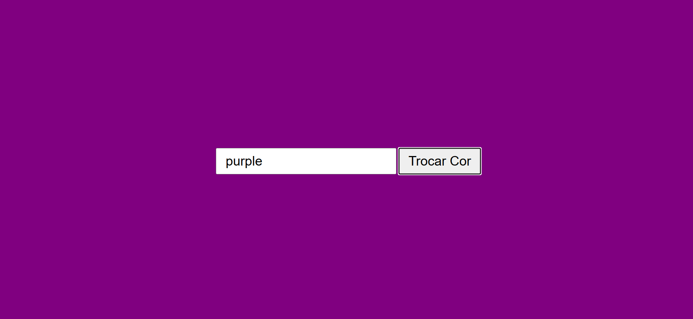

 # Trocar cor da Página WEB

 

 ---
 ## Sobre
 Projeto para trocar a cor de uma página WEB utilizando o javascript.
 

 ---
 ## Tencologias utilizadas
 - HTML
 - CSS
 - JS

 ---
 ## Autor

 - [Fernando Leonid](https://github.com/fernandoleonid/)